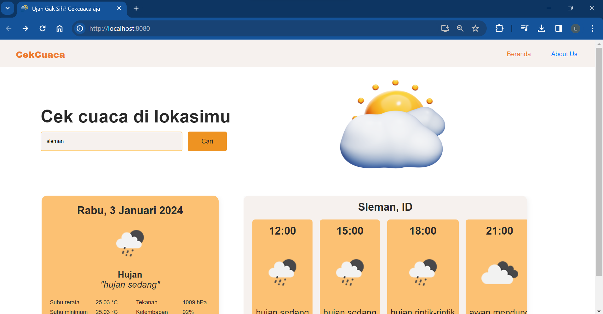

# Web Cekcuaca 

## Deskripsi

**Cekcuaca** adalah website sederhana untuk memeriksa perkiraan cuaca pada suatu kota yang dikembangkan menggunakan Vue.Js and [OpenWeather](https://openweathermap.org/) API.

## Fitur

- Menampilkan perkiraan cuaca suatu kota
- Menampilkan perkiraan cuaca per 3 jam

## Anggota Kelompok
- Syahrul Maula Azmi	    (21520241002)
- Surya Agung Saputra 	    (21520241003)
- Lutfi Nur Rohmah 		    (21520241014)
- Damar Albaribin Syamsu 	(21520244009)
- Hanasta David Fauza 		(21520244011)

## Screenshoots

<div align="center">
    
</div>

## Requirements for Development

- [`Node Js`](https://nodejs.org/en/)
- [`npm`](https://www.npmjs.com/get-npm)
- [`VueJs`](https://vuejs.org/)

## Installation for Development

1. Open your terminal or command prompt
2. Type `git clone https://github.com/solehudin5699/CekCuaca.git`
3. Open the folder and type `npm install` for install dependencies
4. Create file **_.env_** in root directory with the following contents :

```bash
VUE_APP_APIKEY ="APIKEY_FROM_OPENWEATHER"
```

Example :

```bash
VUE_APP_APIKEY ="77cfcaf621af0234cd0504axxxxxxxxxx"
```

Visit [OpenWeather](https://openweathermap.org/) for getting apikey

5. Type `npm run serve` in terminal for running this project.
6. If you want to build, type `npm run build`.
